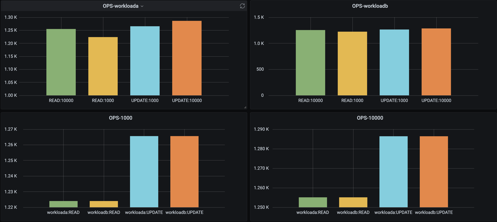

# ycsb_collecter
collect go-ycsb output, export to prometheus

## go-ycsb说明
go-ycsb是一个用go实现的性能测试框架[go-ycsb](https://github.com/pingcap/go-ycsb)，源自于[ycsb](https://github.com/brianfrankcooper/YCSB)
go-ycsb的安装及介绍详见上述链接。

## ycsb_collecter说明
ycsb_collecter是用python实现的go-ycsb输出结果收集器，主要用于解决go-ycsb的输出结果的可视化问题。
具体来说
- 解析go-ycsb的输出内容，标准化成可以方便使用的格式（dict）
- 利用[prometheus_python_client](https://github.com/prometheus/client_python#counter)组织成可以被prometheus识别的格式（Gauge）
- 通过pushgateway输出到prometheus做持久化存储，并通过grafana展示。

### 使用方式 (mysql为例)
1. 采集go-ycsb的输出结果
```
# load
./bin/go-ycsb load mysql -P workloads/workloada -p mysql.host=127.0.0.1 -p mysql.port=3306 -p mysql.user=root -p mysql.db=<db_name> -p mysql.password=passwd -p recordcount=10000
# run
./bin/go-ycsb run mysql -P workloads/workloada -p mysql.host=127.0.0.1 -p mysql.port=3306 -p mysql.user=root -p mysql.db=<db_name> -p mysql.password=<passwd> -p recordcount=10000  -p operationcount=1000 -p threadcount=1 > <filepath>.log
```
2. 执行ycsb_collecter
```
git clone https://github.com/dgyhh/ycsb_collecter.git
python run.py workload_type=workloada filepath=<filepath>.log
```

| 参数|默认值|说明|
|:----:|:----:|:---------:|
|workload_type| workloada|可选|
|filepath||必选，ycsb输出日志的路径|
|pushgateway_host||必选，Pushgateway地址|
3. 部署Prometheus和Pushgateway
可参照[prometheus官方文档](https://github.com/prometheus/prometheus)
测试用的Prometheus是部署在Kubernetes集群，本地测试的时候可以用以下方式暴露pushgateway服务
```
kubectl port-forward svc/prometheus-pushgateway 2021:9091 -n <namespace>
```
4. Grafana结果展示
