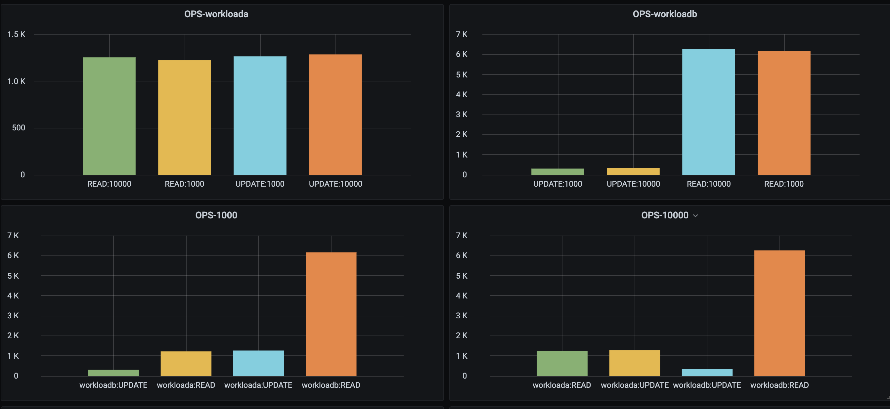
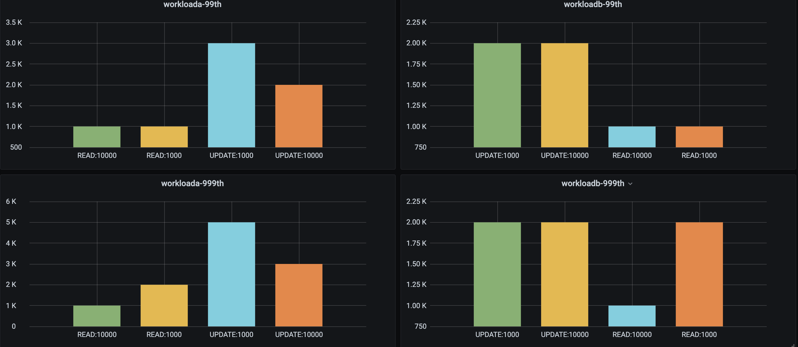
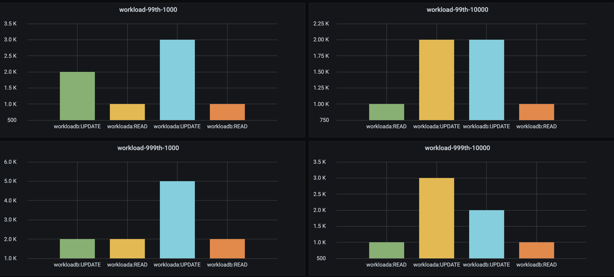
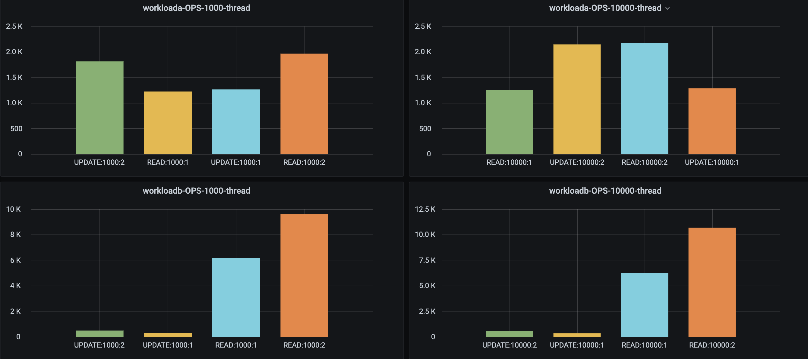

# ycsb_collecter (pingcap小作业)
## 题目如下

> 使用 go-ycsb（https://github.com/pingcap/go-ycsb）测试 mysql 数据库，其输出结果是以文本形式输出到 stdout 的，
> 请实现一个监控采集器使 ycsb 结果能被 prometheus 采集到。选取你认为比较重要的几个指标即可


## go-ycsb说明
go-ycsb是一个用go实现的性能测试框架[go-ycsb](https://github.com/pingcap/go-ycsb)，源自于[ycsb](https://github.com/brianfrankcooper/YCSB)
go-ycsb的安装及介绍详见上述链接。

## ycsb_collecter说明
ycsb_collecter是用python实现的go-ycsb输出结果收集器，主要用于解决go-ycsb的输出结果的可视化问题。
具体来说
- 解析go-ycsb的输出内容，标准化成可以方便使用的格式（dict）
- 利用[prometheus_python_client](https://github.com/prometheus/client_python#counter)组织成可以被prometheus识别的格式（Gauge）
- 通过pushgateway输出到prometheus做持久化存储，并通过grafana展示。

### 使用方式 (mysql为例)
1. 采集go-ycsb的输出结果
```
# load
./bin/go-ycsb load mysql -P workloads/workloada -p mysql.host=127.0.0.1 -p mysql.port=3306 -p mysql.user=root -p mysql.db=<db_name> -p mysql.password=passwd -p recordcount=10000
# run
./bin/go-ycsb run mysql -P workloads/workloada -p mysql.host=127.0.0.1 -p mysql.port=3306 -p mysql.user=root -p mysql.db=<db_name> -p mysql.password=<passwd> -p recordcount=10000  -p operationcount=1000 -p threadcount=1 > <filepath>.log
```

2. 部署Prometheus, Pushgateway, Grafana

可参照[prometheus官方文档](https://github.com/prometheus/prometheus)，[grafana官方文档](https://github.com/grafana/grafana)  
测试用的Prometheus是部署在Kubernetes集群，本地测试的时候可以用以下方式暴露pushgateway服务
```
kubectl port-forward svc/prometheus-pushgateway 2021:9091 -n <namespace>
```

3. 执行ycsb_collecter
```
git clone https://github.com/dgyhh/ycsb_collecter.git
python run.py workload_type=workloada filepath=<filepath>.log pushgateway_host=127.0.0.1:2021
```

| 参数|默认值|说明|
|:----:|:----:|:---------:|
|workload_type| workloada|可选|
|filepath||必选，ycsb输出日志的路径|
|pushgateway_host||必选，pushgateway地址|

4. Grafana结果展示


> OPS-workloada 展示了在负载不变的情况下(workloada)，operationcount=1000/10000对OPS的影响。可见，在operationcount比较小的时候，不会影响OPS。OPS-workloadb同理。
> OPS-1000展示了在operationcount=1000的情况下，负载类型（workloada/workloadb）对OPS的影响。OPS-10000同理。


> workloada-99th展示了在负载不变的情况下(workloada)，operationcount(1000/10000)对99分位的最大时延的影响。
> 可见update的时延要高于read时延，且operationcount较小的时候，更容易波动。其他同理。


>workload-99th-1000 展示了在operationcount不变的情况下（1000）, 负载类型(workloada/workloadb)对99分位最大时延的影响。其他同理。


> workloada-OPS-1000-thread展示了，在其他条件一定的情况下，threadcount(1000/10000)对OPS的影响。可见在每种情况下，提升tread数量可以明显提高性能。其他同理。

### 其他
1. 通过pushgateway删除指定job的metrics
```
# 假设，pushgateway grouping_key是 {'job': 'ycsb-collecter', 'workload': 'workloada', 'operation_count': 10000}删除他需要如下命令
curl -X DELETE http://127.0.0.1:2023/metrics/job/ycsb-collecter/workload/workloada/operation_count/10000
其中，127.0.0.1:2023为pushgateway 地址
```

2. pushgateway需要添加grouping_key，相同的job和grouping_key的数据会被覆盖，grouping_key可与label相同，例如：
```
push_to_gateway(pushgateway_host, job='ycsb-collecter', registry=registry,
                grouping_key={'job': 'ycsb-collecter', 'workload': workload_type, 'thread_count': thread_count)
```